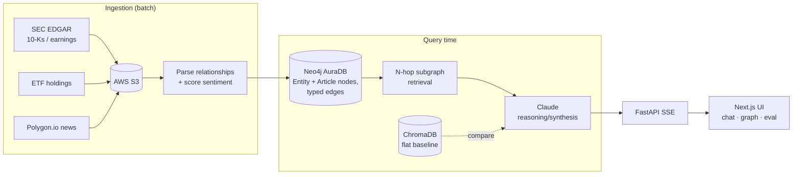

# Market Sentiment Propagation Graph

A **Graph RAG** system that reasons about how market sentiment *cascades* between
related companies. Traditional sentiment analysis scores a stock in isolation —
NVIDIA earnings sentiment gets applied only to NVDA. But real markets don't work
that way: sentiment propagates through supply chains, competitor relationships,
ETF co-membership, and sector links (NVIDIA earnings move AMD, TSMC, and data
center REITs, often within hours).

This project models those relationships as a graph in Neo4j and lets an LLM
traverse and reason over them at query time. The core demonstration is a
**side-by-side comparison** showing where flat/vector RAG fails a multi-hop
question ("what's affected by NVDA earnings?") and graph RAG succeeds.

> **Learning project.** v1 favors LLM-inferred reasoning over precomputed edge
> weights — the output is a reasoned natural-language answer, **not** a
> backtestable trading signal. This is not investment advice. See
> [`CLAUDE.md`](CLAUDE.md) for the full PRD, architecture decisions, and roadmap
> (including the deferred v2 quantitative approach).

---

## Why graph RAG?

Flat RAG retrieves document chunks by semantic similarity, so it can only reach
entities that are *named in the text* near the question. It has no structural way
to discover that TSMC is NVDA's supplier unless a chunk happens to mention both.
Graph RAG retrieves the **N-hop neighborhood** of the trigger entity from Neo4j —
the actual disclosed relationships — and hands that subgraph plus supporting text
to the LLM. The graph constrains what the model can claim (no hallucinated
connections) while the LLM judges relevance, direction, and magnitude.

### Evaluation results

On a fixed set of 8 multi-hop test questions (`python -m src.eval.run_eval`),
graph RAG vs. the flat-vector baseline using the **same** reasoning model:

| Metric | Graph RAG | Flat RAG |
|---|---|---|
| Entity recall | **100%** | 76% |
| Retrieval coverage | **100%** | 55% |
| LLM-judge win rate | **75%** (6 wins) | 25% (2 wins) |

The only variable is the retrieval layer, so the gap isolates "graph traversal vs.
flat vector search." Flat RAG scores comparably on raw *correctness of what it did
surface* — it just systematically **misses related entities** graph traversal reaches.

---

## Architecture



**Graph schema** — `Entity` nodes (ticker, name, sector) connected by typed,
directed edges: `SUPPLIES_TO` / `SUPPLIED_BY`, `COMPETES_WITH`, `CO_HOLDS_ETF`,
`SECTOR_PEER`. `Article` nodes (filings, earnings, news) carry a sentiment score
and point to their entity via `ABOUT`.

**Ticker universe (v1):** NVDA, AMD, TSM, AVGO, ASML, MSFT, AMZN, GOOGL, ORCL,
DLR, EQIX.

---

## Tech stack

| Layer | Tool |
|---|---|
| Raw storage | AWS S3 |
| Graph database | Neo4j AuraDB (Cypher) |
| Filings / data | SEC EDGAR, ETF holdings, Polygon.io |
| LLM reasoning | Anthropic Claude (via `anthropic` SDK + MCP tool loop) |
| Flat RAG baseline | ChromaDB |
| Backend | FastAPI (SSE streaming) |
| Frontend | Next.js + TypeScript (`web/`) |

---

## Getting started

### Prerequisites

- Python 3.10+
- Node.js 18+ (for the `web/` frontend)
- A [Neo4j AuraDB](https://console.neo4j.io) instance (free tier is fine)
- An [Anthropic API key](https://console.anthropic.com)
- Optional: AWS S3 bucket + [Polygon.io](https://polygon.io) key (free tier) for
  running the full ingestion pipeline yourself

### 1. Configure

```bash
git clone <your-fork-url>
cd Market-Sentiment-Analyzer

python -m venv .venv && source .venv/bin/activate
pip install -r requirements.txt

cp .env.example .env   # then fill in your Neo4j URI/creds and API keys
```

`.env` is gitignored — see [`.env.example`](.env.example) for every variable.

### 2. Ingest & build the graph

Run the uploaders (fetch filings/ETF/news into S3), then parse and load into Neo4j:

```bash
python -m src.ingestion.edgar_client          # 10-Ks / annual reports → S3
python -m src.ingestion.earnings_client       # earnings releases → S3
python -m src.ingestion.etf_holdings          # ETF holdings → S3
python -m src.ingestion.polygon_news_client   # ticker news → S3
python -m src.ingestion.ingest_from_s3        # parse triples + score sentiment
python -m src.ingestion.load_graph            # load Entity/Article nodes into Neo4j
python -m src.retrieval.flat_rag build        # build the ChromaDB baseline index
```

### 3. Query

```bash
# Graph RAG, single N-hop traversal around a ticker:
python -m src.retrieval.reason NVDA "How does NVDA's earnings affect AMD, TSMC, and data center REITs?"

# Agentic chatbot (LLM picks which graph tools to call):
python -m src.retrieval.chat "What's trending down in semiconductors right now?"

# Flat RAG baseline, same question:
python -m src.retrieval.flat_rag query "How does NVDA's earnings affect AMD, TSMC, and data center REITs?"

# Full graph-vs-flat comparison, writes src/eval/results.json:
python -m src.eval.run_eval
```

### 4. Run the web app

The UI has three views: an agentic **chat** with a live-rendered relationship
graph, a **graph explorer**, and an **eval scoreboard**.

```bash
# Terminal 1 — backend:
uvicorn src.api.server:app --reload --port 8000

# Terminal 2 — frontend:
cd web && npm install && npm run dev
```

Open <http://localhost:3000>.

---

## Project layout

```
src/
  ingestion/    Fetch (EDGAR/ETF/Polygon) → S3, parse relationships, score sentiment, load Neo4j
  retrieval/    subgraph (N-hop), reason (graph RAG), flat_rag (baseline), chat (agentic)
  mcp_server/   Graph retrieval exposed as MCP tools for the agentic loop
  eval/         Graph-vs-flat test set, metrics, LLM-as-judge, run_eval
  api/          FastAPI SSE backend for the web UI
  tests/        Connection smoke tests (Neo4j, LLM)
web/            Next.js frontend (chat · graph explorer · eval scoreboard)
CLAUDE.md       Full PRD, architecture decisions, and build roadmap
```

---

## Disclaimer

This is a personal learning project exploring graph RAG mechanics. It does not
produce investment advice or a validated trading signal, and nothing here should
be used to make financial decisions.

---

## License

[MIT](LICENSE) © 2026 Brian Cochran
